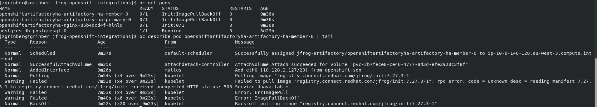

# jfrog-integrations-openshift
Validate Integrations of JFrog Artifactory &amp; X-RAY with Openshift

## Installing Jfrog-Artifactory HA using Operator in operatorHub At Openshift

- Operator installed Successfully through openshift web Console  --> Operators --> OperatorHub --> Search for `Jfrog Artifactory Enterprise Operator`
- but any attempt to create OpenshiftArtifactoryHa Custom resource failing, used the default template from installed `JFrog Artifactory Enterprise Operator` page , tab `Artifactory HA` --> Click on button `Create OpenshiftArtifactoryHa` --> Switch to YAML view
```yaml
kind: OpenshiftArtifactoryHa
apiVersion: charts.helm.k8s.io/v1
metadata:
  name: openshiftartifactoryha
spec:
  artifactory-ha:
    artifactory:
      image:
      joinKey: 40f2948c3715621d41b17a995a92f9d2121a5c9b829b4ad09c9d1d611df7ae17
      masterKey: 40f2948c3715621d41b17a995a92f9d2121a5c9b829b4ad09c9d1d611df7ae17
      node:
        replicaCount: 2
        waitForPrimaryStartup:
          enabled: false
    databaseUpgradeReady: true
    database:
      driver: org.postgresql.Driver
      password: 0lK9PfftNg
      type: postgresql
      url: jdbc:postgresql://postgres-db-postgresql:5432/artifactory
      user: postgres
    nginx:
      uid: '1001530000'
      gid: '1001530000'
      http:
        externalPort: 80
        internalPort: 8080
      https:
        externalPort: 443
        internalPort: 8443
      service:
        ssloffload: false
      tlsSecretName: tls-cert
    postgresql:
      enabled: true
    waitForDatabase: true
```

- Anyway the Deployment failed because unable to pull images, I got 503 http code(already 5 days without change) , as can be seen in following error from several pods:



## Installing JFrog-artifactory using helm chart:

Note: a License is Pre-requisite to the installation, as it needed for activating an instance on openshift, we'll use a free trial 30 days evaluation license
Which can be obtained from [here with short registration](https://jfrog.com/start-free/#hosted)
1. Add jfrog helm repository to your helm client, We'll activate only the primary node, and the others will remain inactivated , so we'll not work in HA Mode.
```shell
helm repo add jfrog https://charts.jfrog.io ; helm repo update
```
2. Generate a random hexadecimal number key for the Master node:
```shell
export MASTER_KEY=$(openssl rand -hex 32)
```
3. switch to namespace jfrog-integrations
```shell
oc project jfrog-integrations
```
4. Add securityContextConstraints `anyuid` and `hostmount` to default serviceAccount in namespace:
```shell
 oc adm policy add-scc-to-user anyuid -z default
 oc adm policy add-scc-to-user hostmount -z default 
```

5. install the artifactory chart:
```shell
helm upgrade --install artifactory-ha --set artifactory.masterKey=${MASTER_KEY} jfrog/artifactory-ha
```

6. Wait for all pods to become ready:
```shell
oc get pods -w
```

7. Once ready, expose route for service `artifactory-ha-artifactory-ha-primary`:
```shell
oc expose svc/artifactory-ha-artifactory-ha-primary --name=artifactory
```

8. Open Artifactory instance
```shell
oc get route artifactory -o=jsonpath="{..spec.host}" | xargs -i xdg-open http://{}
```

9. In a new window, get the default username and password of artifactory from helm notes section 2:
```shell
helm get notes artifactory-ha
```

10. Login in the new page that was opened in your browser with the credentials gained from previous section.
11. Change password to a new one , preferably more strong password.
12. Activate license by copy-paste it when prompted. 
13. You can start work on Artifactory single node mode.

**Note: Please take into account that beside pod `artifactory-ha-artifactory-ha-primary-0`, all other pods will keep restarted because they're not licensed, you can ignore it.**
```shell
[zgrinber@zgrinber jfrog-openshift-integrations]$ oc get pods 
NAME                                      READY   STATUS    RESTARTS         AGE
artifactory-ha-artifactory-ha-member-0    0/1     Running   13 (21s ago)     144m
artifactory-ha-artifactory-ha-member-1    0/1     Running   12 (7m2s ago)    139m
artifactory-ha-artifactory-ha-primary-0   1/1     Running   0                144m
artifactory-ha-nginx-bb6549b46-rzmjc      0/1     Running   12 (4m22s ago)   144m
artifactory-ha-postgresql-0               1/1     Running   0                144m
[zgrinber@zgrinber jfrog-openshift-integrations]$ 
```
**_In case it's a concern , you can always scale down statefulset/artifactory-ha-artifactory-ha-member and deploymet/artifactory-ha-nginx to zero and to save resources:_**
```shell
oc scale statefulsets.apps artifactory-ha-artifactory-ha-member --replicas=0
oc scale deployment artifactory-ha-nginx --replicas=0
```

**Note: X-RAY is out of scope for the tests as it requires PRO license of artifactory for activation in Artifactory's WEB UI.**

## Testing Artifactory Integration with Openshift' BuildConfig, DeploymentConfig, ImageStream(Tags) And Route. 

### Pre-requisites:
- Create in Artifactory Virtual Maven Repository, to act as a proxy for maven central, and reduce downloading time for artifacts after first retrieval, define in artifactory' settings that anonymous access is enabled.
- Create a Docker repository in Artifactory, For holding the images
- We'll use an existing demo spring boot application( [repo here](https://github.com/zvigrinberg/aop-aspects-and-interceptors)) with `Source` strategy.
- Assuming that we're working on `jfrog-integrations` namespace.

### Procedure:

1. Create the Application in openshift using S2I(Source 2 Image)
- Pass environment variable MAVEN_MIRROR_URL to Builder with address of virtual maven repository created in artifactory.
- Pass Environment Variable MAVEN_ARGS to override maven args(such as profile and java compiler version 11 to build with)
- Use the appropriate builder image for java containing JDK 11.
- Since there are 2 projects in the above repo , pass context-dir=spring-aop-example. 
```shell
oc new-app  registry.redhat.io/ubi8/openjdk-11~https://github.com/zvigrinberg/aop-aspects-and-interceptors.git  --context-dir=spring-aop-example --build-env="MAVEN_ARGS=-e -Pdefault -DskipTests -Dcom.redhat.xpaas.repo.redhatga package -Djava.version=11" --build-env="MAVEN_MIRROR_URL=http://artifactory-ha:8082/artifactory/maven-all"
```
2. Wait for build to be finished, and then see that the application is up:
```shell
oc logs aop-aspects-and-interceptors-1-build -f
oc get pods -w
```
3. Expose the application as route
```shell
oc expose svc/aop-aspects-and-interceptors
```
4. After application is up and running, test it's working:
```shell
oc get route aop-aspects-and-interceptors -o=jsonpath="{..spec.host}" | xargs -i xdg-open http://{}/hello
```

6. Patch the buildconfig with output of a external docker image, of artifactory repository via route.
```shell
 cat > buildconfig-patch.yaml << EOF
spec:
  output:
    to:
      kind: DockerImage
      name: arti-jfrog-integrations.apps.ocp-dev01.lab.eng.tlv2.redhat.com/docker-quickstart-local/aop-aqspects-and-interceptors:latest
EOF

oc patch bc/aop-aspects-and-interceptors  --patch-file buildconfig-patch.yaml
```


6. Create image Pull secret for docker repository in artifactory(using credentials of an authorized user in artifactory):
```shell
oc create secret docker-registry artifactory-docker-ps --docker-server=arti-jfrog-integrations.apps.ocp-dev01.lab.eng.tlv2.redhat.com    --docker-username=admin    --docker-password=password
```
7. Link the image pull secret to both service accounts of namespace, builder and default:
```shell
oc secrets link default artifactory-docker-ps --for=pull
oc secrets link builder artifactory-docker-ps --for=mount
oc secrets link builder artifactory-docker-ps --for=pull
```
8. Now There are two options for interacting with Artifactory, Secured with TLS, and insecure. 
#### Configure Artifactory's Docker Repository as an insecure Registry
- Add Artifactory' Docker repository to be allowed as insecure registry in the cluster, in order to bypass tls verification(artifactory in trial version doesn't support https): 
```shell
cat > cluster-image.yaml << EOF
spec:
  registrySources:
    allowedRegistries:
    - quay.io
    - registry.redhat.io
    - image-registry.openshift-image-registry.svc:5000
    - docker.io
    - gcr.io
    - acr.io
    - registry.access.redhat.com
    - finiqapp.azurecr.io
    - artifactory-jfrog-integrations.apps.ocp-dev01.lab.eng.tlv2.redhat.com
    insecureRegistries:
    - artifactory-jfrog-integrations.apps.ocp-dev01.lab.eng.tlv2.redhat.com
EOF

oc patch image.config.openshift.io/cluster --patch-file cluster-image.yaml
```

#### Configure Artifactory's Docker Repository as a secured Registry
 
 I Will choose this option, as it's more secured and not affecting custom external registries. \
 Will Create A Self Signed Certificate Using our own Certificate Authority, and Install it on an Openshift' Edge Route:
- Create a Certificate Authority
```shell
openssl req -x509 -sha256 -days 356  -nodes -newkey rsa:2048 -subj "/CN=arti-jfrog-integrations.apps.ocp-dev01.lab.eng.tlv2.redhat.com/C=IL/L=Tel Aviv" -keyout rootCA.key -out rootCA.crt
```
- Create A Private key
```shell
openssl genrsa -out server.key 2048
```
- Create A Configuration file for a Certificate Signing Request(CSR)
```shell
cat > csr.conf <<EOF
   [ req ]
   default_bits = 2048
   prompt = no
   default_md = sha256
   req_extensions = req_ext
   distinguished_name = dn
   
   [ dn ]
   C = IL
   ST = Israel
   L = Tel Aviv
   O = Redhat
   OU = EcoSystem Engineering
   CN = arti-jfrog-integrations.apps.ocp-dev01.lab.eng.tlv2.redhat.com
   
   [ req_ext ]
   subjectAltName = @alt_names
   
   [ alt_names ]
   DNS.1 = arti-jfrog-integrations.apps.ocp-dev01.lab.eng.tlv2.redhat.com
   
EOF   
```
- Create the CSR File using the private key created earlier and the csr.conf file: 
```shell
openssl req -new -key server.key -out server.csr -config csr.conf
```
- Create Configuration file that will be used to sign and create the certificate
```shell
cat > cert.conf <<EOF
   authorityKeyIdentifier=keyid,issuer
   basicConstraints=CA:FALSE
   keyUsage = digitalSignature, nonRepudiation, keyEncipherment, dataEncipherment
   subjectAltName = @alt_names
   
   [alt_names]
   DNS.1 = arti-jfrog-integrations.apps.ocp-dev01.lab.eng.tlv2.redhat.com
EOF
```
- Create the Certificate, Using the CA, CSR file and configuration file cert.conf:
```shell
openssl x509 -req     -in server.csr     -CA rootCA.crt -CAkey rootCA.key     -CAcreateserial -out server.crt     -days 365     -sha256 -extfile cert.conf
```
- Now Create an Openshift Route With a TLS Edge Termination:
```shell
oc create route edge   --service=artifactory-ha --cert=server.cert --key=server.key --ca-cert=rootCA.cert  --hostname=arti-jfrog-integrations.apps.ocp-dev01.lab.eng.tlv2.redhat.com
```

- Install The CA(Certificate Authority) As a Trusted CA in The Cluster, So Openshift Will be able to push and pull Images to and from Artifactory Registry in a secured way:
```shell
# Create ConfigMap with the CA
oc create configmap registry-cas -n openshift-config --from-file=arti-jfrog-integrations.apps.ocp-dev01.lab.eng.tlv2.redhat.com=rootCA.cert
# Define CA as a trusted one by openshift cluster.  
oc patch image.config.openshift.io/cluster --patch '{"spec":{"additionalTrustedCA":{"name":"registry-cas"}}}' --type=merge
```
9. Start a new build
```shell
oc start-build aop-aspects-and-interceptors
```
10. Watch the build progress, and wait for application to be up and running.
```shell
oc logs aop-aspects-and-interceptors-2-build -f
oc get pods -w
```
11. Once finished, you can enable image change trigger (if not already enabled) and tag a new ImageStreamTag using the newly pushed docker image (to Artifactory' docker repo) in order to Start a new deployment 
```shell
oc set triggers dc/aop-aspects-and-interceptors --from-image=jfrog-integrations/aop-aspects-and-interceptors:latest -c aop-aspects-and-interceptors
oc tag --source=docker arti-jfrog-integrations.apps.ocp-dev01.lab.eng.tlv2.redhat.com/docker-quickstart-local/aop-aqspects-and-interceptors:latest aop-aspects-and-interceptors:latest --scheduled
````

12. Check that the deployment config rolled out a new  deployment and a new pod was created, check that the image is from artifactory repository:
```shell
oc get pods -w
## Ctrl+c/z when above up and running
oc get pods | grep aop-aspects-and-interceptors | grep -v -E 'deploy|build'  | sort --reverse | awk '{print $1}' | xargs -i oc get pod {} -o=jsonpath="{..image}" | tr ' ' '\n'

```
13. After application is up and running, test it:
```shell
oc get route aop-aspects-and-interceptors -o=jsonpath="{..spec.host}" | xargs -i xdg-open http://{}/hello
```

14. In Artifactory UI, kindly Check that the application image pushed to artifactory' docker repository `docker-quickstart-local` 


### Integrate Artifactory With Openshift Pipelines(Tekton CI/CD Pipelines)
- First, Delete all resources created by oc new-app/buildConfig:
```shell
oc delete all -l app=aop-aspects-and-interceptors
```
- We will create a pipeline, Using Openshift Pipelines(Tekton) , And will use Helm in it to deploy the sample application to Cluster.

**_Note: At the end, when finishing with all tests, kindly restore  image.config.openshift.io/cluster to original state:_**
```shell
oc patch image.config.openshift.io/cluster --type merge -p 'spec: {}'
```

15. When finished, Release all resources by uninstalling the Chart, and deleting the namespace
```shell
helm uninstall artifactory-ha -n jfrog-integrations
oc delete project jfrog-integrations
```
